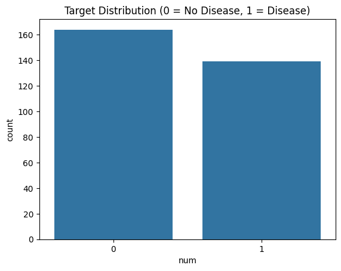
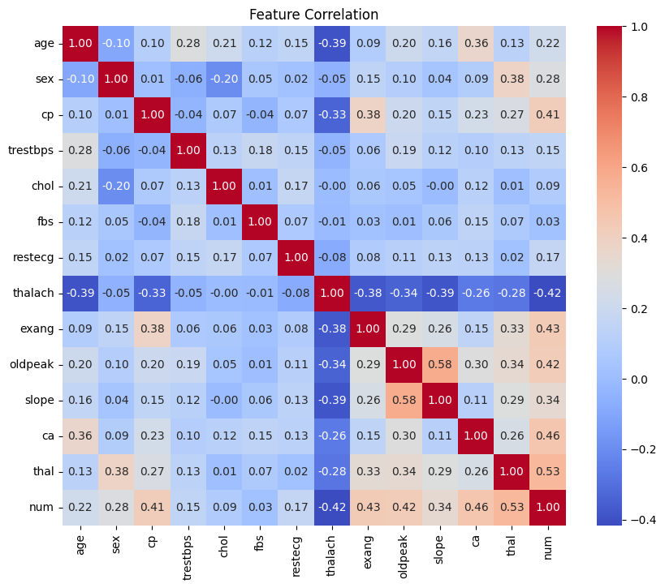

# 🫀 Heart Disease Prediction - Machine Learning Project

## 📌 Overview
This project uses **Machine Learning** to predict heart disease based on patient health records.  
It includes:
- Data cleaning & preprocessing
- Exploratory Data Analysis (EDA)
- Model training & evaluation
- Model export for deployment
- Streamlit web app for predictions

---


## 📂 Project Structure
Heart_Disease_Project/
│
├── data/ # Raw & processed datasets + plots
│       ├── heart.csv
│       ├── Decision Tree.png
│       ├── Dendogram.png
│       ├── feature_corr.png
│       ├── KMean.png
│       ├── PCA_projection.png
│       ├── PCA_Var.png
│       ├── Random Forest.png
│       ├── SVM.png
│       ├── ROC.png
│       ├── target_dist.png
│       ├── plots/
│       │   ├── logistic_regression_cm_roc.png
│       │   ├── decision_tree_cm_roc.png
│       │   ├── random_forest_cm_roc.png
│       │   └── svm_cm_roc.png
│       └── cleaned_heart.csv 
│
├── model/
│       └── final_model.pkl # Best trained model
│
├── notebooks/ # All Jupyter notebooks
│       ├── 01_data_preprocessing.ipynb
│       ├── 02_pca_analysis.ipynb
│       ├── 03_feature_selection.ipynb
│       ├── 04_supervised_learning.ipynb
│       ├── 05_unsupervised_learning.ipynb
│       └── 06_hyperparameter_tuning.ipynb
│
├── results/ # All Jupyter notebooks
│       ├── cleaned_heart.csv
│       ├── clustring_results.csv
│       ├── feature_importance.csv
│       ├── pca_heart.csv
│       └── selected_features.txt
│
├── ui/
│       └── app.py # Streamlit app for predictions
│
├── deployment/
│       └── run_app_with_ngrok.py # Ngrok 
├── requirements.txt
└── README.md


---

## 📊 Dataset
- **Source:** UCI Heart Disease Dataset
- **Rows:** 303
- **Columns:** 13 features + 1 target
- **Target:**
  - `0` → No heart disease
  - `1` → Heart disease present

**Features:**
- **Numeric:** age, trestbps, chol, thalach, oldpeak
- **Categorical:** sex, cp, fbs, restecg, exang, slope, ca, thal


## 📈 Exploratory Data Analysis (EDA)

**Target Distribution:**


**Feature Correlation Heatmap:**


---

## 🤖 Model Training & Evaluation
We trained:
- Logistic Regression
- Decision Tree
- Random Forest
- SVM

| Model               | Accuracy | Precision | Recall | F1 Score | ROC AUC |
|---------------------|----------|-----------|--------|----------|---------|
| Logistic Regression | 0.85     | 0.85      | 0.88   | 0.86     | 0.92    |
| Decision Tree       | 0.79     | 0.78      | 0.81   | 0.79     | 0.80    |
| **Random Forest**   | **0.87** | **0.88**  | **0.88** | **0.88** | **0.94** |
| SVM                 | 0.83     | 0.83      | 0.86   | 0.84     | 0.91    |

---

## 📉 Confusion Matrices & ROC Curves

**Random Forest (Best Model):**


**Other Models:**
| Logistic Regression | Decision Tree | SVM |
|---------------------|---------------|-----|
|  |  |  |

---

## 🚀 Run the Streamlit App

    python deployment/run_app_with_ngrok.py

## ⚙️ Installation
```bash
# Clone the repo
git clone https://github.com/a7med57/Heart-Disease-ML.git
cd Heart-Disease-ML 

# Install dependencies
pip install -r requirements.txt


